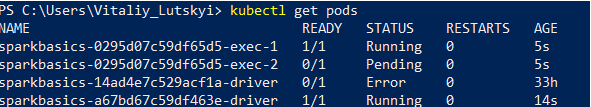
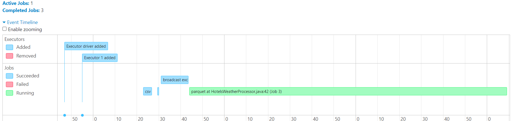
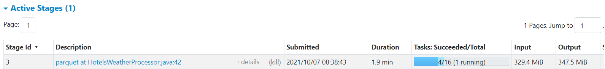
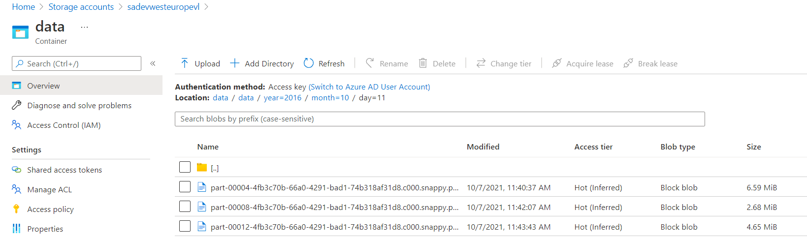

* Add your code in `src/main/`
* Test your code with `src/tests/`
* Package your artifacts
* Modify dockerfile if needed
* Build and push docker image
* Deploy infrastructure with terraform
```
terraform init
terraform plan -out terraform.plan
terraform apply terraform.plan
....
terraform destroy
```
* Launch Spark app in cluster mode on AKS
```
spark-submit \
    --master k8s://https://<k8s-apiserver-host>:<k8s-apiserver-port> \
    --deploy-mode cluster \
    --name sparkbasics \
    --conf spark.kubernetes.container.image=<spark-image> \
    ...
```

####Kubernetes pods


####Spark jobs


####Spark stages


####Result parquet files


####Docker repo
https://docker.io/vitaliylutskyi/data-engineering-training